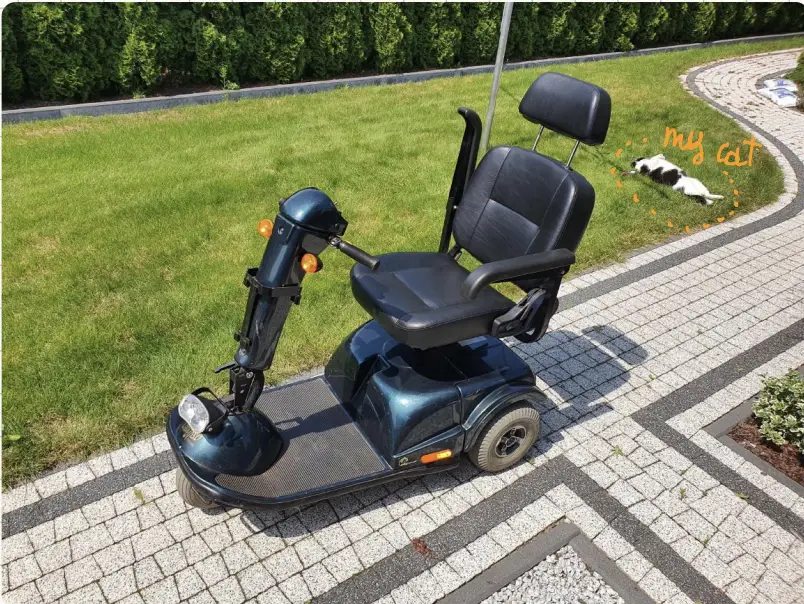

# Chariot of Heaven

Take a look at [the project overview](project.pdf) to learn more.

[Video](https://www.youtube.com/watch?v=WWUe42dH6nw)

### Commands

- `w` start moving forward
- `s` start moving backward
- `q` stop moving

- `a` start turning left
- `d` start turning tight
- `z` stop turning

- `x` stop all

### Wiring

**Info diodes**

- red - GPIO17
- green - GPIO22
- yellow - GPIO27

**Servo**

- PWM - GPIO18

~~- servo - GPIO10~~ (probably not???)

**Stepper motor**

stepper motor driver: MP6500 Pololu 2966

- STEP - GPIO20 (yellow diode)

- DIR - GPIO21 (red diode)

  Red diode is ON when the direction is right. It is OFF when the direction is left.
